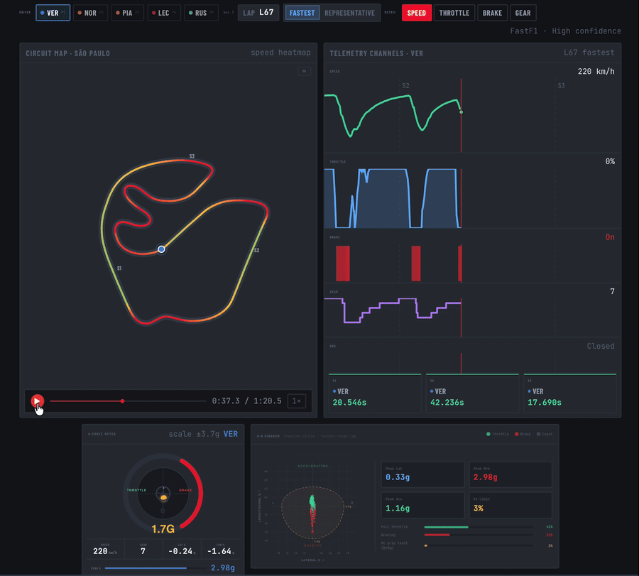
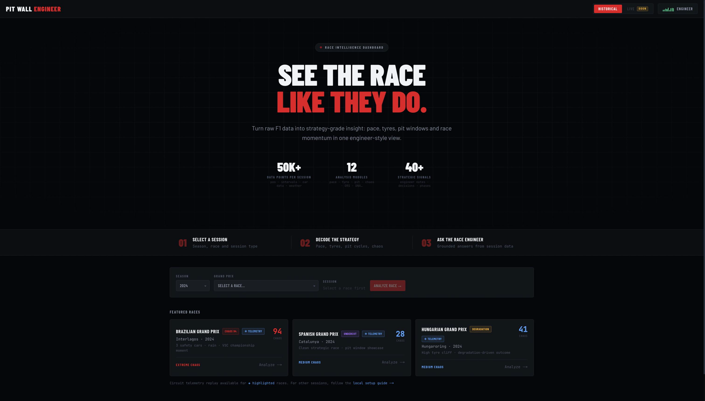
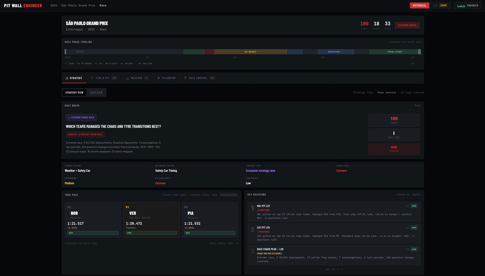
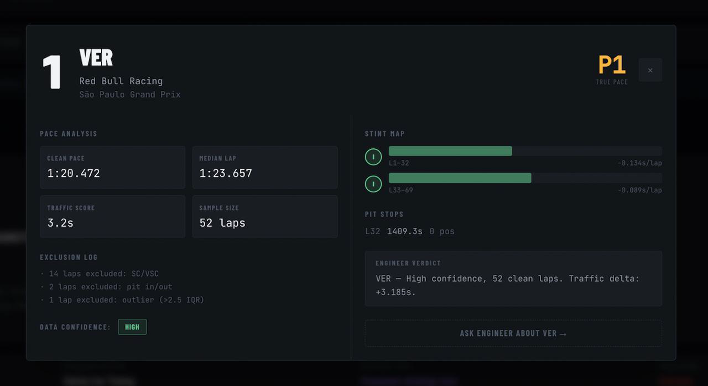
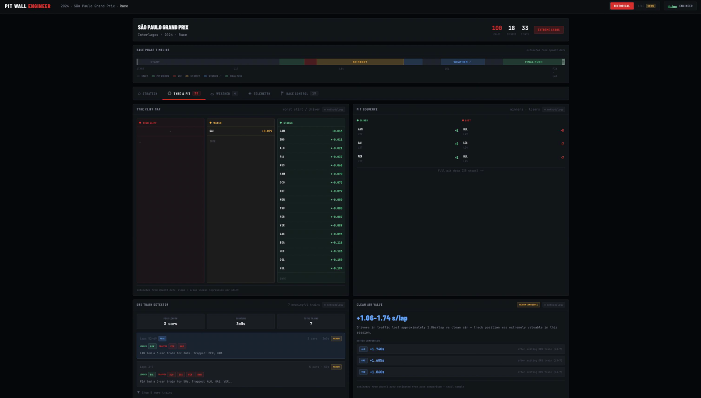
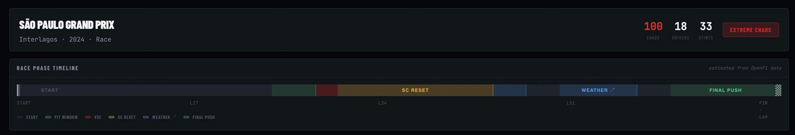
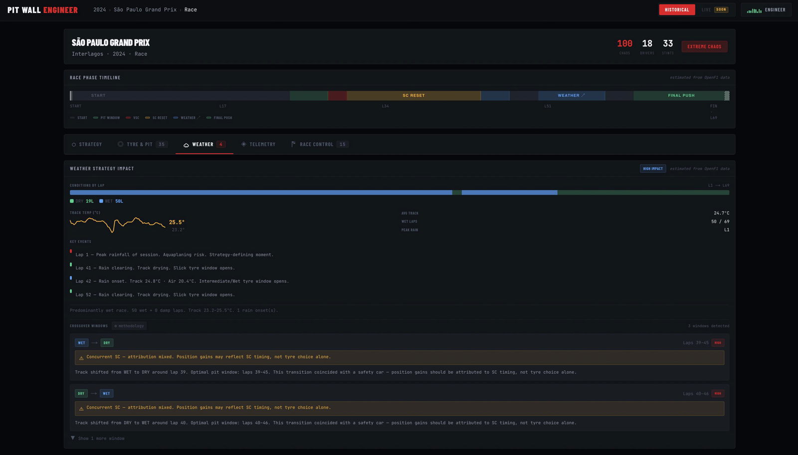
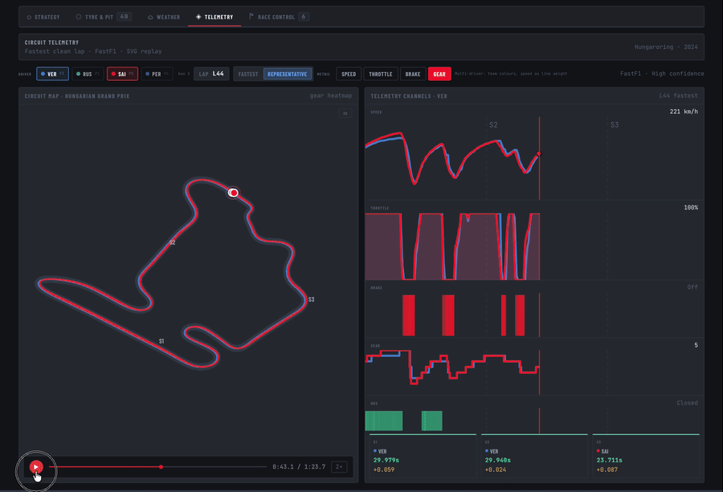
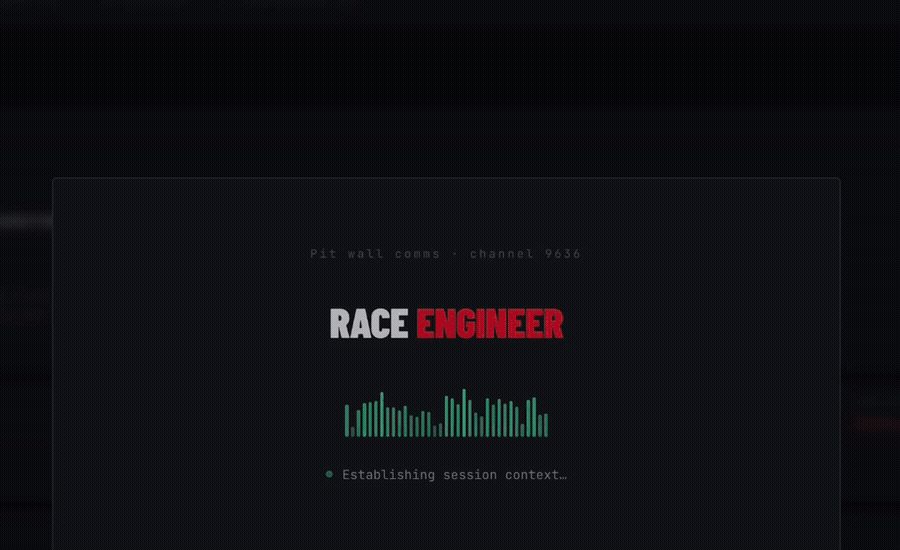

<div align="center">

# Pit Wall Engineer

### Watch F1 like an engineer, not like a spectator.

A post-race intelligence dashboard that turns raw Formula 1 timing data into the analysis a race engineer would actually run — real pace, tyre degradation, pit impact, race phases, weather crossovers, and telemetry replay.


</div>

<p align="center">
  
</p>

---

## What it does

After a Formula 1 race, the broadcast tells you who finished where. Pit Wall Engineer tries to answer the harder question: **why did that happen?** It surfaces the underlying story — who was actually fast when you strip out safety cars and traffic, who gained or lost positions through pit timing, where tyres started to fall off the cliff, and which decisions shaped the final order.

The pipeline is straightforward: the backend fetches raw data from OpenF1 across eight endpoints (laps, stints, pit stops, position, intervals, race control, weather, driver metadata), caches it per session, then runs a sequence of analytical services that build a single canonical `RaceTimeline` object. Every service reads from the same timeline, which keeps the analysis consistent across modules. The result is a typed `FullRaceAnalysis` JSON payload served to the Next.js frontend.

What makes it more than a timing table is the layer of interpretation on top of the data. Clean laps are separated from safety car and traffic-affected laps before pace is ranked. Pit stop impact is calculated using timestamp-interpolated position data, not just lap numbers. Weather crossovers track which drivers were early, on-time, or late relative to when conditions changed — and flag when a safety car happened to coincide with the window. The telemetry replay lets you watch any driver's throttle, brake, gear, and speed trace with a synchronised circuit map.

<p align="center">
  
  <br />
  <em>Select any season from 2023–2025, any Grand Prix, any session.</em>
</p>

<p align="center">
  
  <br />
  <em>Strategy view — São Paulo Grand Prix 2024. Chaos 100/100 — Extreme.</em>
</p>

---

## Features

### True Pace Ranking

Raw lap-time averages lie: they fold in pit laps, safety car crawls, and the odd mistake. The pace service filters every driver's laps down to clean racing laps — excluding pit in/out laps, safety car and VSC neutralised laps, laps with no timing, and statistical outliers beyond 2.5× IQR — then ranks drivers on the median of what's left. Each result carries a confidence level derived from the clean-lap sample size and an exclusion log that shows exactly which laps were dropped and why, so the ranking is auditable rather than a black box.



### Tyre Degradation & Pit Stop Impact

Degradation is measured as the linear-regression slope of lap time across each stint, so a driver nursing a set of hards shows a gentle gradient while someone on the edge shows a steep one — classified into a cliff-risk level. Pit stops are scored on `lane_duration` against a benchmark, then combined with position data one lap before and three laps after the stop to produce a verdict: positions gained, lost, or neutral. Together they answer whether an undercut actually worked or just looked busy.



### Race Phase Timeline & Chaos Index

The race is segmented into labelled phases — start/sorting, pit window, safety car reset, VSC period, weather crossover, DRS compression, final push — resolved by a priority order so that a lap under a safety car is never mislabelled as ordinary racing. The Chaos Index rolls the disorder into a single 0–100 score built from safety cars, yellow flags, investigations, penalties, rain transitions, and total position volatility, and pins down the single `peak_chaos_lap` where the race was most out of shape.



### Weather Winners & Losers

When the track transitions wet→dry or dry→wet, the crossover detector finds the window and classifies each driver's timing. The important guard here is that when a safety car overlaps a weather transition, the summary explicitly notes the concurrent SC and downgrades confidence — position gains during a crossover under safety car aren't attributed to tyre choice alone, which is where naive analyses go wrong.



### Circuit Telemetry Replay

The telemetry tab pulls lap data from FastF1 and plays back synchronised speed, throttle, brake, and gear channels against an animated SVG circuit map. You can watch the fastest clean lap for outright pace, or a representative lap closest to the driver's median for how they drove on average — one running independently of the OpenF1 analysis pipeline, keyed only on year, circuit, and session type.



### AI Race Engineer

The chat is grounded in the session's own computed analysis, not a general-purpose model guessing from memory. Before answering, it receives a compact summary of the actual signals — chaos score and peak lap, top clean-pace drivers, tyre cliffs, pit sequence, and race control events — so its answers reference this specific race and carry the same confidence framing as the rest of the dashboard. The model never sees raw OpenF1 arrays, only the interpreted analysis.



### Also included

- **DRS Train Detection** — identifies groups of three or more cars stuck within one second of each other and how long each train held together.
- **Pit Stop Impact detail** — per-stop breakdown of lane time and net position change with a plain-language verdict.
- **Race DNA Card** — a deterministic eight-point fingerprint of the race (tyre management, strategy sensitivity, overtaking difficulty, and more), fully reproducible from the same input.

---

## Architecture

The backend is a FastAPI application with an async OpenF1 client (httpx, `asyncio.Semaphore(3)` for concurrency, three-attempt exponential backoff). All OpenF1 responses are cached as JSON files per session and treated as immutable for historical races — no TTL, no re-fetch. The central design decision is a `RaceTimeline` object built once per session from all raw data, which every downstream service uses as its source of truth. This avoids each service independently resolving timestamps and lap boundaries. Data processing uses Polars; models are Pydantic v2.

The frontend is Next.js 14 with the App Router, TypeScript strict mode, a custom Tailwind design system (no default palette), Framer Motion for transitions, and Zustand for race state. The interface separates analysis into two modes (Strategy View and Data View) and five tabs: Strategy, Tyre & Pit, Weather, Race Control, and Telemetry. The Circuit Telemetry Replay tab uses FastF1 for lap data and renders everything in animated SVG — no canvas, no external charting libraries for the telemetry panel.

```
OpenF1 API
↓
FastAPI backend (Python)
├── Async client (httpx + semaphore + retry)
├── File-based JSON cache (per session_key)
├── RaceTimeline builder (canonical object, shared across all services)
└── Services: pace · tyre · pit · chaos · dna · drs · weather · crossover
             race_phase · clean_air · notes · decisions · telemetry
↓
FullRaceAnalysis (typed Pydantic model, cached as _analysis.json)
↓
Next.js 14 frontend (TypeScript)
├── Strategy View / Data View toggle
├── 5 tabs: Strategy · Tyre & Pit · Weather · Race Control · Telemetry
├── Circuit Telemetry Replay (FastF1 + animated SVG, G-G diagram)
└── AI Race Engineer chat (Ollama, session context injected as system prompt)
```

---

## Tech stack

| Layer | Tech |
|---|---|
| Backend | Python 3.11, FastAPI, Pydantic v2, httpx, Polars, NumPy |
| Frontend | Next.js 14, TypeScript strict, Tailwind CSS, Framer Motion, Zustand, Recharts |
| Telemetry | FastF1, NumPy, SVG animation |
| Data | OpenF1 REST API, file-based JSON cache per session |
| AI | Ollama (local), llama3.1:8b |

---

## Local setup

### Prerequisites

- Python 3.11+
- Node.js 18+
- Ollama with `llama3.1:8b` (optional — AI chat only)

### Backend

```bash
cd backend
python -m venv .venv
source .venv/bin/activate  # Windows: .venv\Scripts\activate
pip install -r requirements.txt
cp .env.example .env
uvicorn app.main:app --reload
```

### Frontend

```bash
cd frontend
npm install
npm run dev
```

Open http://localhost:3000

### AI race engineer (optional)

```bash
ollama pull llama3.1:8b
ollama serve
```

The chat feature works without Ollama — it degrades gracefully with a clear message rather than breaking the rest of the analysis.

### Telemetry for additional sessions (optional)

The featured sessions (Brasil 2024, España 2024) include precomputed telemetry. To generate it for any other cached session, run:

```bash
cd backend
python scripts/precompute_telemetry.py --sessions <session_key> --drivers VER,NOR,LEC,PIA,RUS
```

Replace `<session_key>` with the OpenF1 session key (e.g. `9662` for Abu Dhabi 2024). The script writes a JSON file to `backend/cache/` that the telemetry endpoint serves on the next request.

---

## Data source

Data via [OpenF1](https://openf1.org) — free, no API key required for historical sessions. Historical race data is available from 2023 onwards. The backend caches all OpenF1 responses per session key and endpoint, so loading a race a second time is near-instant and works offline. Cache files are treated as immutable for past sessions.

---

## License

MIT. Not affiliated with Formula 1, FIA, or any F1 team.  
OpenF1 data is used under their open data terms.
